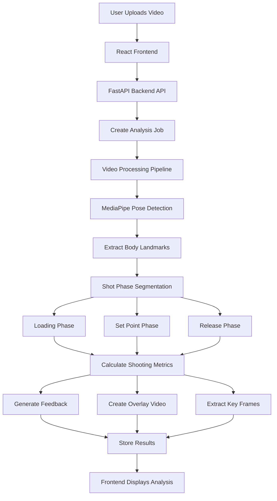

# 🏀 Basketball Shot Analyzer

An AI-powered basketball shooting analysis tool that uses computer vision to analyze a player's shooting form and provide feedback on key shooting mechanics.

Upload a basketball shot video and receive:
- 🎥 An annotated overlay video showing pose tracking
- 📸 Key frames from important shooting phases
- 📊 Shooting mechanics breakdown
- 💡 Personalized feedback based on detected form

---

# 🚀 Demo

Live Application: https://basketball-shot-analyzer.vercel.app/

---

# 📌 Features

## Computer Vision Analysis

- Detects human pose landmarks using MediaPipe
- Tracks shooting motion through different phases:
  - Loading / Dip
  - Set Point
  - Release / Follow Through
- Calculates biomechanical metrics:
  - Elbow angle
  - Knee angle
  - Trunk lean

## Automated Feedback

Analyzes shooting mechanics and provides suggestions based on:

- Knee bend
- Upper body alignment
- Shooting arm position
- Follow-through mechanics

## Video Processing

- Generates an annotated video overlay with pose connections
- Extracts key frames representing important shooting moments
- Processes videos asynchronously using background jobs
- Automatically removes expired analysis results

## Web Application

- Responsive React frontend
- FastAPI backend API
- Background processing pipeline
- Job-based result tracking

---

# 🛠️ Tech Stack

## Frontend

- React
- Vite
- React Router
- CSS

## Backend

- Python
- FastAPI
- MediaPipe Pose Landmarker
- OpenCV
- FFmpeg

## Deployment

- Frontend: Vercel
- Backend: Render
- Containerization: Docker

---

# 🏗️ Architecture



---

# 🔍 Analysis Pipeline

## 1. Pose Detection

The system extracts body landmarks from each video frame using MediaPipe.

Tracked landmarks include:

- Shoulders
- Elbows
- Wrists
- Hips
- Knees
- Ankles

These landmarks are used to calculate joint angles and analyze shooting mechanics.

---

## 2. Shot Phase Detection

The shot is divided into different phases:

### Loading

Identifies the deepest point of the player's dip.

Analyzed metrics:
- Knee angle
- Trunk lean

### Set Point

Finds the position where the shooting arm reaches its optimal loading position.

Analyzed metrics:
- Elbow angle
- Knee extension
- Body alignment

### Release / Follow Through

Analyzes the final shooting motion.

Analyzed metrics:
- Elbow extension
- Knee extension
- Body alignment

---

## 3. Feedback Generation

The system compares detected mechanics against ideal shooting ranges and generates actionable feedback.

Example:

```
Feedback

Knee bend: 81.9° (Target: 105°-135°)
Don't dip quite as much.
```

---

# 📂 Project Structure

```
basketball-shot-analyzer/
├── backend/
│   ├── Dockerfile
│   ├── main.py
│   ├── requirements.txt
│   ├── cleanup.py
│   ├── scheduler.py
│   │
│   ├── analysis/
│   │   ├── compute_angles.py
│   │   ├── detect_side.py
│   │   └── shot_segmenter.py
│   │
│   ├── processing/
│   │   ├── extract_landmarks.py
│   │   ├── create_overlays.py
│   │   └── keyframe_selector.py
│   │
│   ├── feedback/
│   │   └── snapshot_feedback.py
│   │
│   ├── services/
│   │   ├── shot_pipeline.py
│   │   └── shot_service.py
│   │
│   ├── routes/
│   │   ├── pose_routes.py
│   │   └── download.py
│   │
│   ├── assets/
│   │   └── pose_landmarker.task
│   │
│   └── storage/
│
├── frontend/
│   ├── package.json
│   ├── vite.config.js
│   ├── index.html
│   │
│   ├── public/
│   │   ├── UploadPhoto.jpg
│   │   ├── AnalysisPhoto.jpeg
│   │   ├── FeedbackPhoto.png
│   │   └── exampleVideo.mov
│   │
│   └── src/
│       ├── App.jsx
│       ├── main.jsx
│       ├── index.css
│       │
│       ├── components/
│       │   ├── Navbar/
│       │   ├── Hero/
│       │   ├── UploadSection/
│       │   ├── ResultsHeader/
│       │   ├── ResultsBreakdown/
│       │   ├── LoadingScreen/
│       │   ├── ExpirationTimer/
│       │   └── Footer/
│       │
│       └── pages/
│           ├── HomePage.jsx
│           ├── UploadPage.jsx
│           ├── LoadingPage.jsx
│           ├── ResultsPage.jsx
│           └── ErrorPage.jsx
│
└── README.md
```

---

# ⚙️ Running Locally

## Backend

Create a virtual environment:

```bash
python -m venv venv
```

Activate the environment:

Mac/Linux:

```bash
source venv/bin/activate
```

Windows:

```bash
venv\Scripts\activate
```

Install dependencies:

```bash
pip install -r requirements.txt
```

Run the backend:

```bash
uvicorn main:app --reload
```

---

## Frontend

Install dependencies:

```bash
npm install
```

Start the development server:

```bash
npm run dev
```

The frontend will run at:

```
http://localhost:5173
```

---

# 📈 Future Improvements

- Use ML to find shot segments instead of basic pose guidelines
- Allow different camera angles/less instructions to follow for accurate feedback
- Compare mechanics against professional shooting forms
- Add historical shot analysis dashboards/Add account tracking
- Improve guidelines for the "perfect shot"

---

# 👨‍💻 About

Built as a full-stack computer vision project combining basketball biomechanics, pose estimation, and modern web development.

The goal of this project is to make basketball shooting analysis more accessible by using AI to provide players with measurable feedback on their shooting mechanics.
